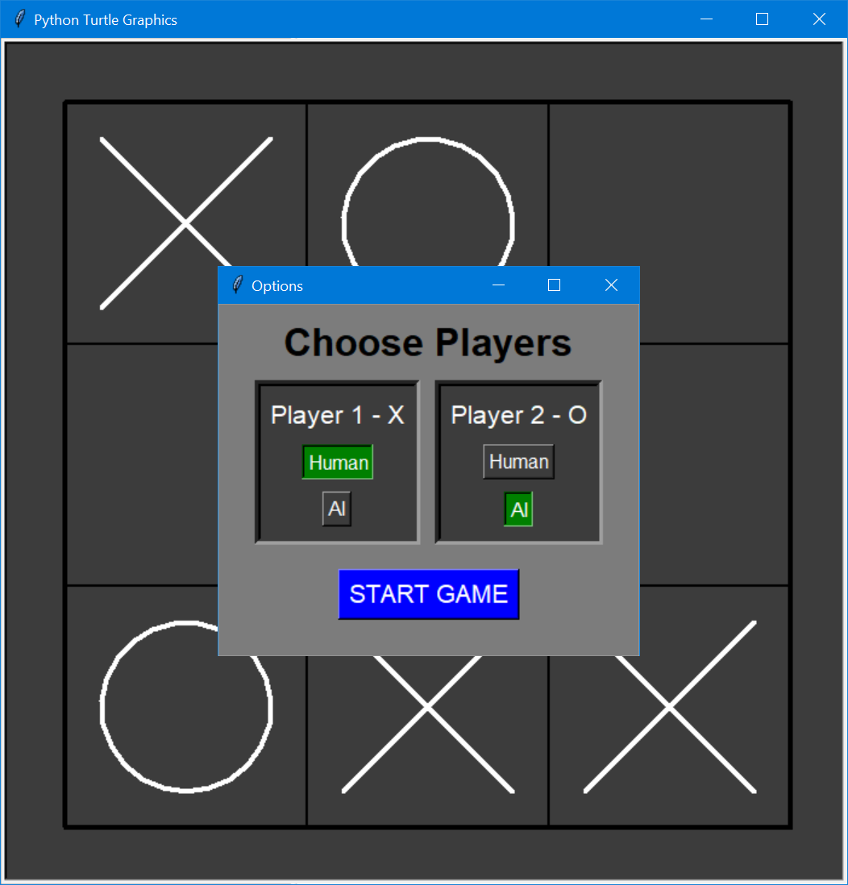

# Tic-Tac-Toe

<h2>The classic game of Tic-Tac-Toe.</h2>

    The initial screen allows you to choose the players. 
    This is a Tkinter window. 
    When closed it passes the player dictionary back to the main code.

    A Turtle Graphics window then opens, and you can play the game.
    <i>Good luck beating the computer!</i> 😎

    This is my first working implementation of the game coded from scratch after learning Python at the excellent Udemy course: 
    
  
        <h2>
            <a href="https://www.udemy.com/course/100-days-of-code/">
                    100 Days of Code - The Complete Python Pro Bootcamp for 2021
            </a>
        </h2>
        by Angela Yu.
    
  

<h2>
    The development process
</h2>

    I first got the main concept code working using a numpy array to store the game state.
    I used a simple text interface in the console, so that I could type in an array location and then print out the array so that I could see the move. 
    I tested several scenarios using the built in unittest module to make sure my game state evaluation was correct.

    Then I needed to get the computer working as an opponent. 
    This led me to research the Minimax Algorithm. 
    I actually got that working quite quickly, but a stupid bug where the computer sometimes chose the wrong move held me up for a couple of days, while I tried to track down what was going on. 

    <b>
        <i>Believe me, manually tracking and debugging the minimax tree is a real PITA!</i>
    </b>
    Again the unittest module helped a lot with various scenarios, making sure the AI chose the correct move for a given starting position.

    Next came the task of creating the GUI. 
    I wanted to start with stuff we had already learned on the course, so I went with Turtle Graphics.
    The implementation was pretty straightforward. 
    The hardest part was figuring out how to detect which section of the grid the mouse was clicked in, 
    and getting the correct coordinates for drawing the X's and O's.
    I was right chuffed when it all came together, and I could click on the screen to make a move... and the AI made a move in reply! :)

    Now, I needed a way for the user to choose players. 
    For this I decided to use a standard Tkinter window.
    That was easy, and it tested just fine in isolation.

    However, when I integrated it into my project, there was a problem. 
    I found that although the widgets appeared to work, the player dictionary wasn't being altered from the default values.
    I noticed that a blank Turtle window was opening just before the Tkinter window. 
    This was obviously interfering with the Tkinter code.
    It took me a while to refactor my code such that the Tkinter window appeared first, without the Turtle Graphics window opening.

    The final step was to get some messages appearing on the Turtle window. 
    For this, I created a Messenger class, which worked fine in isolation.
    However, the same problem occurred again when I integrated it into the project. 

    This time, it was caused by the inheritance of the Turtle class. 
    I finally realised that simply initialising the super().__init__() method was creating a turtle, and in the process was creating a new Turtle Graphics window!
    So I had to delay that initialisation until after the Tkinter window had closed.

Next, I wanted to be able to adjust the grid size. 
After a lot of refactoring to generalize my grid drawing and the code for checking for a win, 
I am now able to set pretty much any DIMENSION in the global_vars.py file. Of course, there's not much point going above 4 x 4.

This introduced another problem. 
The program was taking several minutes to make a decision on the first move. 
Of course, the number of possible moves has increased from 9! for a 3x3 grid to 16! for a 4x4 grid!! 

So I had to limit the number of moves that the minimax algorithm would look ahead. 
This required me to create a new routine to calculate the heuristic value for an incomplete game state.

YAY!! Finally, it's all working! My ultimate aim is to take this and make it 3D. Now that's going to be a challenge ?

